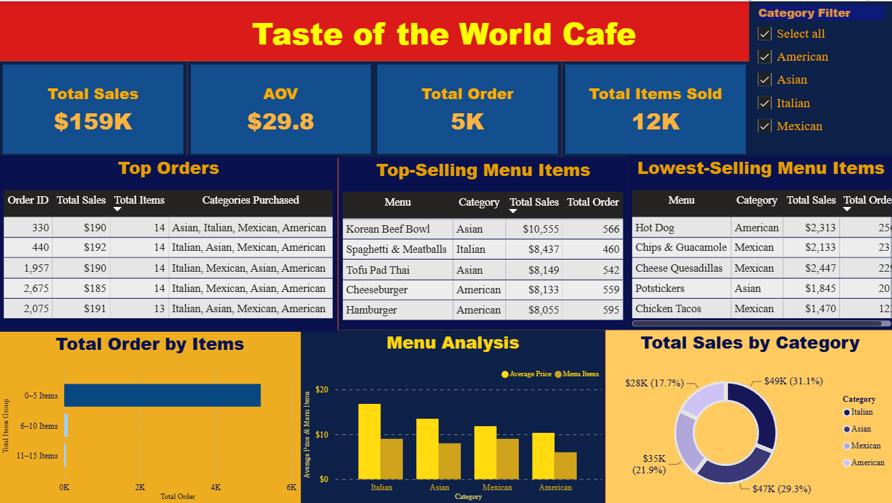

<div align="center">

# 🍽️ Restaurant Order Analysis

### End-to-End Restaurant Sales Analysis using **Python**, **SQL**, and **Power BI**


</div>

---

# 📖 Project Overview

This project analyzes restaurant order transactions to evaluate menu performance, customer preferences, and sales contribution across menu categories. The objective is to identify top-performing menu items, understand customer purchasing behavior, and provide actionable recommendations to optimize the restaurant's menu strategy.

The project follows an end-to-end analytics workflow using **Python** for data cleaning, **SQL** for data integration and business analysis, and **Power BI** for interactive dashboard visualization.

---

# 🎯 Business Background

At the beginning of **2023**, the restaurant introduced several new menu items to attract customers and increase sales. However, management has not yet evaluated whether these new offerings align with customer preferences or contribute positively to overall revenue.

A comprehensive sales analysis is required to determine menu performance and support future business decisions.

---

# ❓ Business Questions

- 🍽️ Which menu items are most and least preferred by customers?
- 📊 Which menu categories contribute the most to total sales?
- 💡 How can the restaurant optimize its menu strategy to increase revenue?

---

# 🛠 Tools & Technologies

- 🐍 Python (Pandas)
- 🗄 SQL
- 📊 Power BI

---

# 🏗 Project Workflow

```text
Raw Datasets
(Order Details & Menu)
          │
          ▼
Data Cleaning
     (Python)
          │
          ▼
Data Integration
   SQL JOIN & Analysis
          │
          ▼
Export Clean Dataset (CSV)
          │
          ▼
Interactive Dashboard
      (Power BI)
          │
          ▼
Business Insights
          │
          ▼
Recommendations
```

---

# 📊 Analysis Scope

The project analyzes multiple aspects of restaurant performance.

| Analysis | Description |
|----------|-------------|
| 📌 Executive KPIs | Sales, Orders, Items Sold, AOV |
| 🍽️ Menu Performance | Best & least-selling menu items |
| 🥗 Category Analysis | Sales contribution by menu category |
| 📦 Order Analysis | Customer ordering behavior |
| 💰 Revenue Analysis | Sales distribution across products |

---

# 📌 Dashboard KPIs

- 💰 **Total Sales:** **$159K**
- 🛒 **Total Orders:** **5,343**
- 🍽️ **Items Sold:** **12K**
- 💵 **Average Order Value (AOV):** **$29.8**

---

# 📁 Repository Structure

```text
restaurant-order-analysis/
│
├── dataset/
│   ├── raw/
│   ├── cleaned/
│   └── restaurant_orders.csv
│
├── python/
│   └── menu_cleaning.ipynb
│   └── orderdetails_cleaning.ipynb
│
├── sql/
│   ├── data_join.sql
│   └── checking_data.sql
│   └── menu_analysis.sql
│   └── orderdetails_analysis.sql
│   └── customer_behavior.sql
│
├── dashboard/
│   ├── Restaurant Dashboard.pbix
│   └── dashboard-preview.png
│
├── presentation/
│   └── Restaurant Analysis Presentation.pptx
│
└── README.md
```

---

# 📊 Dashboard Preview

The Power BI dashboard provides an interactive overview of restaurant performance, including:

- 📌 Executive KPIs
- 🍽️ Top & Bottom Selling Menu
- 🥗 Category Sales Analysis
- 💰 Revenue Distribution
- 📈 Sales Performance Overview

<p align="center">
  
</p>

---

# 💡 Key Insights

### 📊 Overall Performance

- The restaurant generated **$159K** in total sales from **5,343 orders** during **Q1 2023**.
- Customers spent an average of **$29.8** per transaction.

---

### 🥗 Category Performance

- **Italian** contributed the highest sales (**$49K | 31.1%**).
- **Asian** closely followed with **$47K (29.3%)**.
- Together, these two categories accounted for **over 60%** of total revenue.
- **American** generated the lowest category sales (**$28K | 17.7%**).

---

### 🍽️ Menu Performance

- **Korean Beef Bowl** was the best-selling menu item, generating **$10.6K** from **566 orders**.
- **Chicken Tacos** recorded the lowest sales at approximately **$1.5K**, indicating limited customer demand.

---

### 📈 Business Performance

- Sales are concentrated in a small number of high-performing menu items.
- Several menu items contribute relatively little to overall revenue, suggesting opportunities for menu optimization.

---

# 📈 Business Recommendations

- ✅ Expand and promote high-performing categories such as **Italian** and **Asian** through featured menus and marketing campaigns.
- ✅ Maintain inventory availability for best-selling menu items, especially the **Korean Beef Bowl**, to prevent stock shortages.
- ✅ Reevaluate low-performing items such as **Chicken Tacos** by reviewing pricing, recipes, or promotional strategies.
- ✅ Bundle popular menu items with complementary products to increase the average order value.
- ✅ Continuously monitor menu performance and customer preferences when introducing new products.

---

# 🎯 Skills Demonstrated

This project demonstrates:

- ✅ Data Cleaning using Python (Pandas)
- ✅ SQL Data Integration (JOIN)
- ✅ SQL Business Analysis
- ✅ Data Export (CSV)
- ✅ Dashboard Development using Power BI
- ✅ KPI Development
- ✅ Sales & Product Performance Analysis
- ✅ Business Insight Generation
- ✅ Data-Driven Decision Making

---

# 🔮 Future Improvements

- Analyze customer purchasing patterns by time of day.
- Build sales forecasting models for menu demand.
- Perform customer segmentation using RFM Analysis.
- Develop an automated SQL data pipeline.
- Publish the dashboard using Power BI Service.

---

# 📜 License

This project is intended for **educational and portfolio purposes**.

---

<div align="center">

### ⭐ If you found this project useful, consider giving it a star!

</div>
